# AI Chatbot

A **PHP-based AI chatbot** powered by an 8GB Ollama model, allowing personalized conversations with AI profiles, prompt management, and conversation history.

---

## Requirements

- **PHP 8+**  
- **MySQL / MariaDB** (for storing users, profiles, prompts, and chat history)  
- **Node.js** (to run the local server with `server/start_server.sh`)  
- **ngrok** (optional, for exposing the local server to the internet)  
- **Ollama AI** running locally on port `11434` (`gemma3` model, 8GB).

### Hosting Locally

If you want to host the chatbot on your own computer and make it accessible over the internet:

1. Install **Node.js** and **ngrok**.
2. Make sure your **ngrok** account is set up and your auth token is configured.
3. Run the local server:

```bash
sh server/start_server.sh
```
4.  To connect the frontend to your locally hosted Ollama AI server via ngrok, update the fetch URL in `index.php` at line 390:  
```const res = await fetch('http://localhost:11434/v1/chat/completions', {``` 
- with your ngrok public URL, for example:
```const res = await fetch('url-from-ngrok/chat', {```

### Node.js Dependencies

The `node_modules/` folder is not included in the repository. After cloning the repo:

```bash
cd server
npm install
```

## Features

- **User management** with secure login and sessions.
- **AI profiles** with custom prompts for different personalities or behaviors.
- **Conversation history** with last messages preview.
- **User prompts** for quick reuse of saved messages.
- **Responsive and interactive interface** built with HTML/CSS/JavaScript.
- **Direct integration with Ollama AI server** (`gemma3` model).
- **Automatic saving of conversations** to the database.
- **Cross-device support** with localStorage for temporary chat history.

---

## Installation

1. Clone the repository:

```bash
git clone https://github.com/simondvlm/ai-chatbot-ollama.git
cd ai-chatbot
```

2. Configure your database in backend/config.php:
```php
<?php
$host = 'localhost';
$db   = 'your_database';
$user = 'your_user';
$pass = 'your_password';
$charset = 'utf8mb4';

$dsn = "mysql:host=$host;dbname=$db;charset=$charset";
$options = [
    PDO::ATTR_ERRMODE            => PDO::ERRMODE_EXCEPTION,
    PDO::ATTR_DEFAULT_FETCH_MODE => PDO::FETCH_ASSOC,
];

$pdo = new PDO($dsn, $user, $pass, $options);
?>
```

3. Start your Ollama AI server locally on port 11434.

4. Open index.php in your browser.

## Project Structure

- **File Tree: chatbot AI**

```
├── 📁 assets
│   └── 🎨 code.css
|   └── 🎨 style-dark.css
|   └── 🎨 style-light.css
├── 📁 avatars
│   └── 🖼️ default.webp
├── 📁 backend
│   ├── 🐘 config.php
│   ├── 🐘 delete.php
│   ├── 🐘 get.php
│   ├── 🐘 logout.php
│   └── 🐘 process.php
├── 📁 error
│   ├── 🐘 403.php
│   ├── 🐘 404.php
│   └── 🐘 500.php
├── 📁 server
│   ├── 📁 node_modules
│   ├── 🌐 index.html
│   ├── ⚙️ package-lock.json
│   ├── ⚙️ package.json
│   ├── 📄 server.js
│   └── 📄 start_server.sh
├── ⚙️ .htaccess
├── 📄 database.sql
├── 🐘 index.php
├── 🐘 login.php
├── 🐘 profil.php
├── 🐘 prompts.php
├── 📝 readme.md
└── 🐘 settings.php
```


## Usage

- **Log in or register as a user.**

- **Create or select an AI profile.**

- **Type messages in the input area and interact with the AI.**

- **Click on saved prompts to autofill the input.**

- **View or delete previous conversations from the sidebar.**

- **Customize your system prompts and AI profiles in Settings.**

## Screenshots

**Home / Dashboard**  


**Dasboard CPU part1**
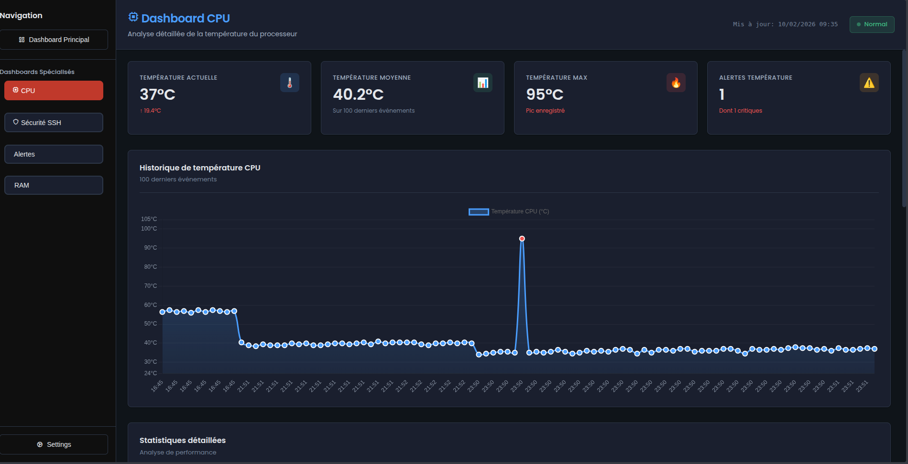

**Dasboard CPU part2**
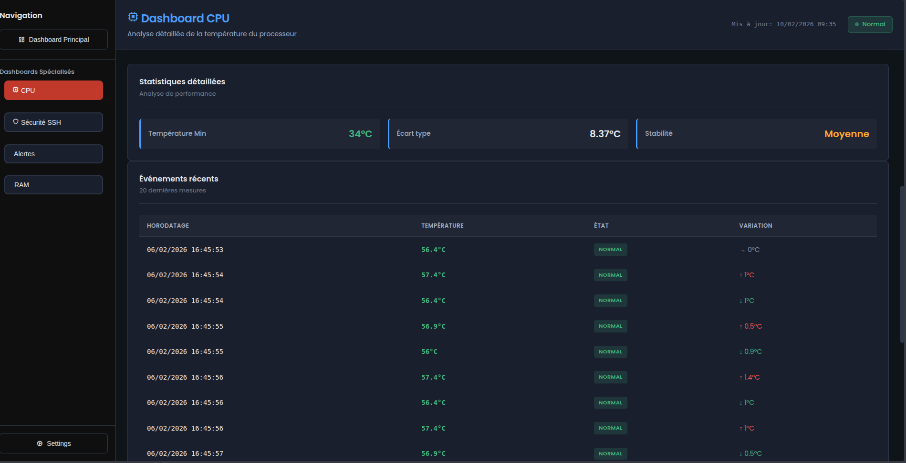

**Dasboard SSH**
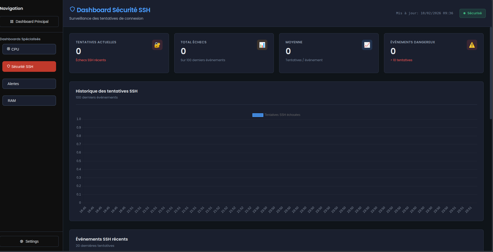

**Dasboard ALERTS**
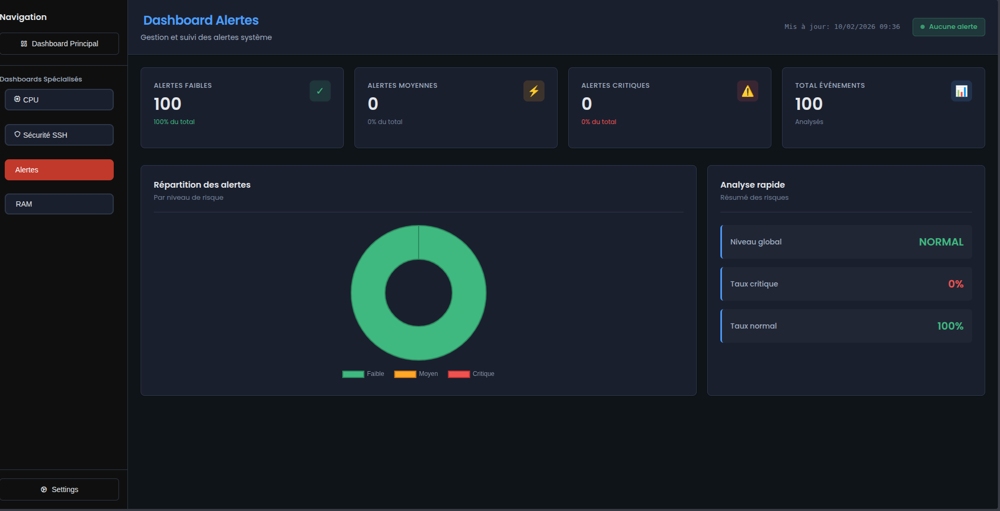

**Dasboard RAM**
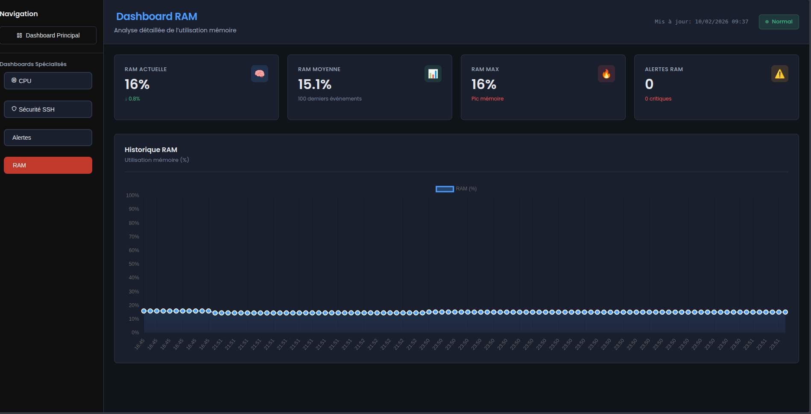

**Login Page**  
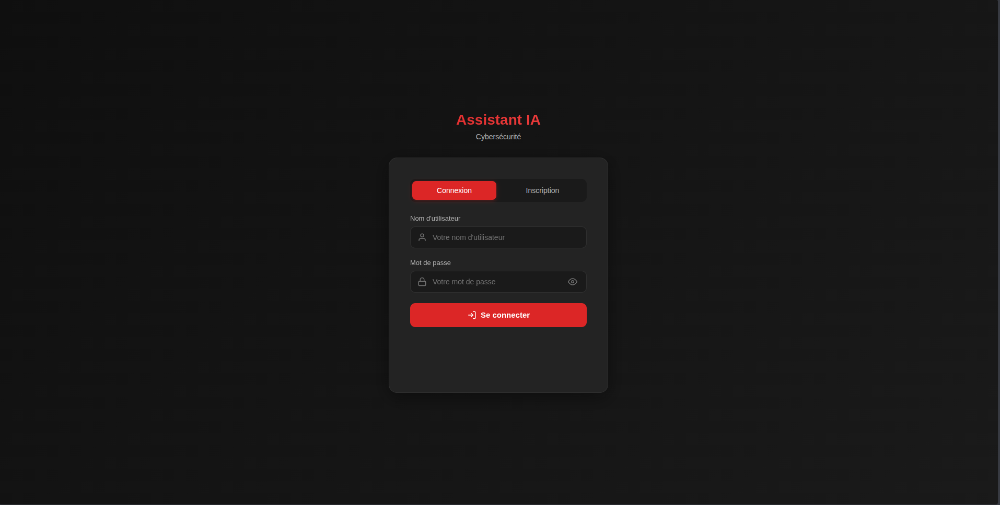

**Signup Page**  
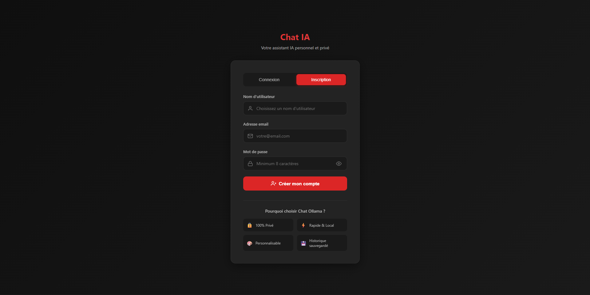

**Chatbot**
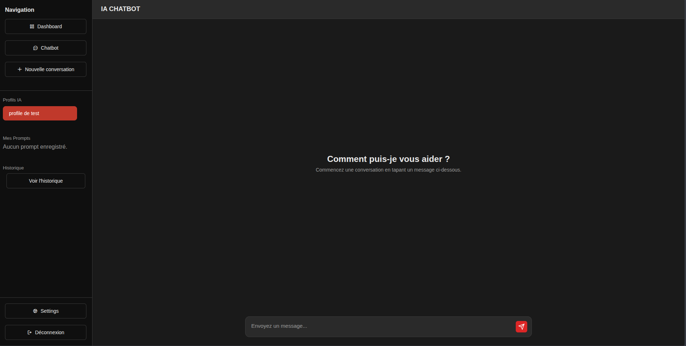

**Bot Typing Indicator**  
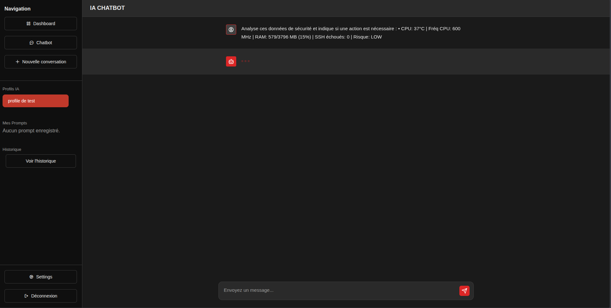

**Bot Response**  
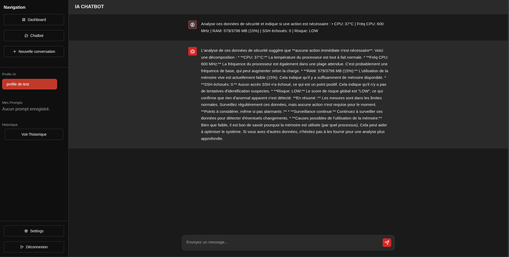

**Profiles**  


**Prompts**  
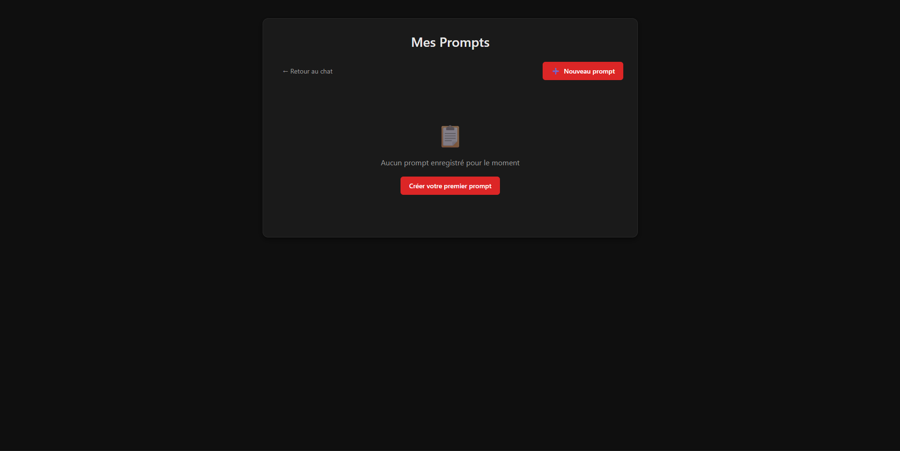

**Settings Part 1**  
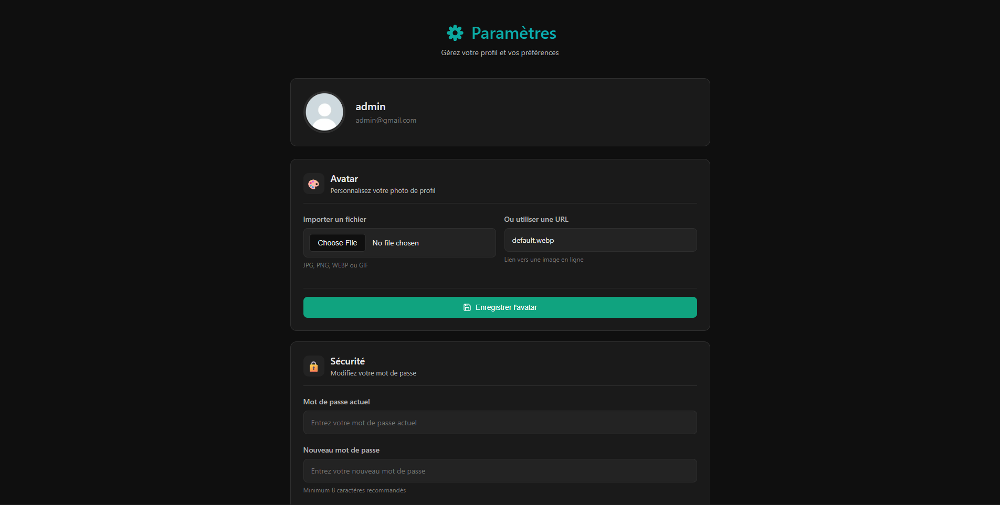

**Settings Part 2**  
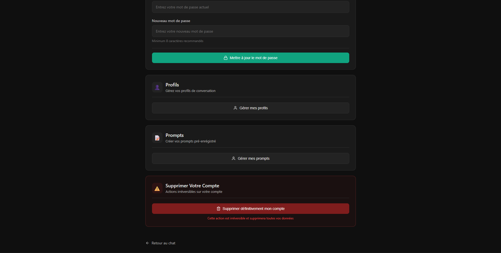


